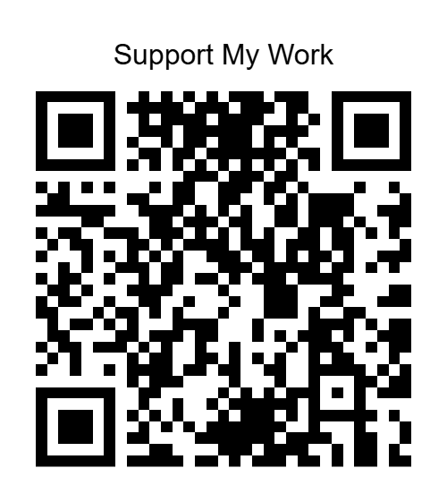

# YouTube by SunFlare94

A feature-rich YouTube client with powerful ad blocking, sponsor blocking, and a beautiful dark mode interface.

## Features

### Ad Blocking

- **Strong Ad Blocker**: Blocks YouTube advertisements including video ads, banner ads, and overlay ads
- **Auto Skip Ads**: Automatically skips advertisements when they appear
- **Block Tracking**: Blocks analytics and tracking scripts

### Sponsor Block

- **Sponsor Block**: Skips sponsored segments in videos using the SponsorBlock API
- **Skip Intro**: Automatically skips video introductions
- **Skip Outro**: Automatically skips video outros
- **Skip Filler**: Skips non-essential filler content

### UI/UX

- **Full Dark Mode**: Complete dark theme throughout the app
- **Immersive Splash Screen**: Beautiful splash screen with "YouTube by SunFlare94" text
- **Material Design**: Modern Material Design interface

## Package Name

`com.youtube.app`

## Requirements

- Android 7.0 (API 24) or higher
- Internet connection

## Building the App

### Using Android Studio

1. Open Android Studio.
2. Select **Open an Existing Project**.
3. Navigate to the `YouTube` folder and select it.
4. Wait for Gradle sync to complete.
5. Click **Build → Build Bundle(s) / APK(s) → Build APK(s)**.

### Using Command Line

cd YouTube
./gradlew assembleDebug

## ❤️ Support Development

If you enjoy this project and would like to support its development, you can optionally contribute using any of the options below.

### 💙 GitHub Sponsors

Support the project through GitHub Sponsors:

**[Support via GitHub Sponsors](https://github.com/sponsors/SunFlare94)**

### 💳 Razorpay

You can make a casual contribution through Razorpay:

**[Support via Razorpay](https://razorpay.me/@SunFlare94)**

### 📱 Support via UPI

Scan the Razorpay QR code below using **Google Pay, PhonePe, Paytm, or any other supported UPI app**.

### 💙 Support via PayPal

You can also support my work through PayPal.

**[Support My Work — PayPal](https://www.paypal.com/ncp/payment/G2365LFLKNKSA)**

The PayPal payment page allows you to **choose the amount you would like to contribute**.

> **Note:** The Razorpay and PayPal options above are for optional support and are not required to use this project.

Your support helps me continue developing and maintaining this project and my other software and digital art projects.

Thank you for your support! ❤️
